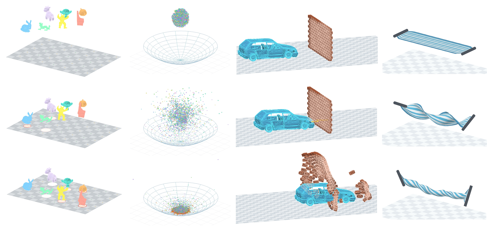
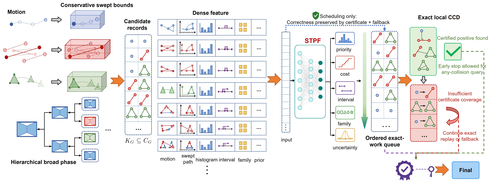

# P2C-CCD

**P2C-CCD** is a proposal-to-certificate framework for certified continuous
collision detection. It combines conservative candidate generation, learned
spatiotemporal proposal-field scheduling, and exact local CCD certificates with
conservative fallback.

The learned component is a scheduler, not a collision oracle. It ranks dense
candidate groups so decisive exact certificates are reached earlier; every final
collision or separation decision is still produced by exact certification or
fallback replay.



The merged GitHub Pages project page is available at `index.html`; it shares the
same release-local media assets and interactive viewers as this repository.

## At A Glance

- Certified final decisions: exact CCD or conservative fallback remains
  responsible for correctness.
- Dense public-source workloads: ABC, Fusion 360 Gallery Assembly, Thingi10K,
  ShapeNetCore, Tight-Inclusion CCD, Scalable-CCD, and supplementary dense
  contact scenes.
- Reproduction-oriented repository: source code, configs, tests, compact
  figures, curated benchmark evidence, and dataset/license manifests are bundled
  directly in this tree.

## Method Overview



```text
geometry + motion
  -> conservative candidate groups
  -> STPF priority order
  -> exact CCD / fallback replay
  -> certified final decision and audit evidence
```

The important boundary is that acceleration stages only propose work. RT/BVH
candidate generation and STPF inference cannot certify the final CCD answer on
their own. Scheduling mistakes may cost extra exact work, but they do not remove
the final exact/fallback coverage requirement.

## Quick Start

Use the CPU-friendly path first:

```powershell
conda activate cudadev
python -m pip install -e src
python scripts\verify_release_cases.py
python -m pytest src\tests\python\test_contracts.py src\tests\python\test_correctness_and_performance_gates.py src\tests\python\test_quality_gate_inventory.py -q
```

Build the default CPU C++ targets:

```powershell
cmake -S src -B src\build -DP2CCCD_BUILD_TESTS=ON -DP2CCCD_BUILD_TOOLS=OFF
cmake --build src\build --config Release
ctest --test-dir src\build -C Release --output-on-failure
```

Optional CUDA, OptiX, ONNX Runtime, and TensorRT paths require local vendor SDKs.
Paper-critical compact checkpoints and evaluation shards are bundled and listed
in `src/docs/model_artifacts_manifest.md`; full raw-dataset reruns still require
the external datasets documented below.

## Runtime Tool Discovery

The core CPU tests do not require Blender, FFmpeg, CUDA, OptiX, ONNX Runtime, or
TensorRT. Optional rendering and GPU rerun scripts discover external tools in
this order:

- explicit environment variables such as `P2CCCD_FFMPEG`, `P2CCCD_BLENDER`,
  `P2CCCD_CPP_ROOT`, `P2CCCD_CPP_BIN`, `CUDA_PATH`, and `CUDA_HOME`;
- executables available on `PATH`;
- project-local build directories and the active conda environment.

Set these variables when rerunning optional visualization or GPU benchmark
paths on a new machine. The release avoids relying on author-specific absolute
paths.

## Data Policy

Bundled directly in this repository:

- core C++ and Python implementation under `src/cpp` and `src/python`
- benchmark-suite configs under `src/configs`
- CPU-oriented tests and quality gates under `src/tests`
- compact project figures under `assets/figures`
- curated benchmark reports and summary tables under `src/benchmark`
- dataset, baseline, license, and artifact manifests under `src/datasets`,
  `src/baseline`, `src/docs`, and `artifacts`

Not bundled by default:

- raw or extracted ABC, Fusion 360, Thingi10K, ShapeNetCore, Tight-Inclusion,
  and Scalable-CCD datasets
- raw full-scale generated shards and checkpoints beyond the bundled compact
  paper-critical artifact set
- third-party baseline repository checkouts
- build products, local caches, and large video/media exports

For full reruns, place external datasets under the paths documented in
`src/datasets/README.md` and external baselines under the paths documented in
`src/baseline/README.md`. The license boundary is documented in
`src/datasets/manifests/licensing_manifest.md` and
`src/docs/third_party_manifest.md`.

## Repository Layout

```text
github_repo_release/
  README.md
  LICENSE
  environment.yml
  assets/figures/
  artifacts/
  scripts/
  src/
    cpp/
    python/
    configs/
    docs/
    tests/
    benchmark/
    datasets/
    baseline/
    tools/
```

Start with:

- `src/README.md`
- `src/docs/reproducibility_quickstart.md`
- `src/docs/paper_case_reproduction.md`
- `src/tests/README.md`
- `artifacts/release_case_manifest.json`
- `artifacts/claim_safety_check.md`

## License

The original P2C-CCD source and repository-specific documentation are released
under the MIT License. External datasets, vendor SDKs, and third-party baseline
implementations retain their own licenses and terms.
